1.Nguyễn Duy Hưng

2.HE190591

3.Project installation instructions

Enable terminal and run comman
- npm init -y
- npm i express

4.Instructions for running the application
Enable terminal and run comman
- node app.js

5.Screenshots API

Article

GET /articles   

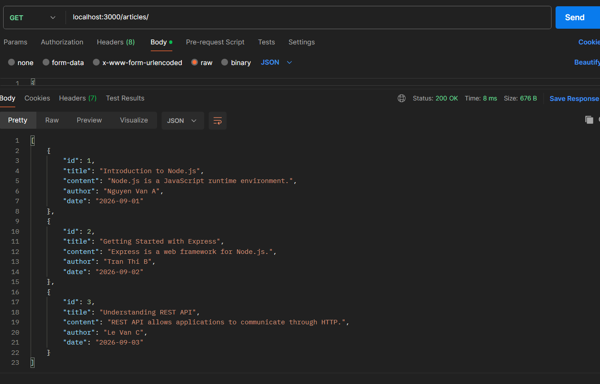

GET /articles:1   

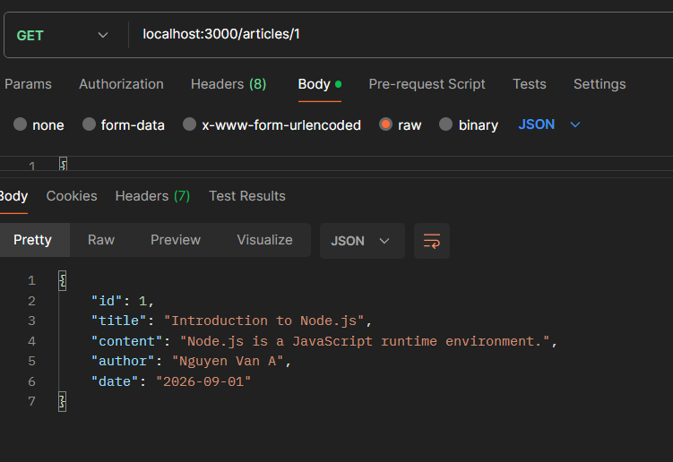

GET /articles:999 

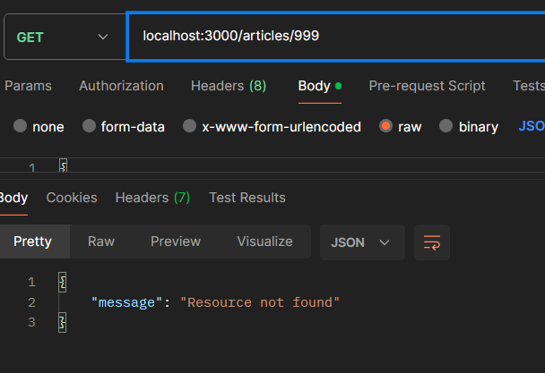

POST /articles

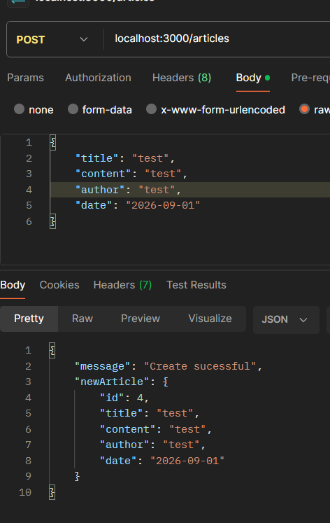

POST /articles    thiếu dữ liệu

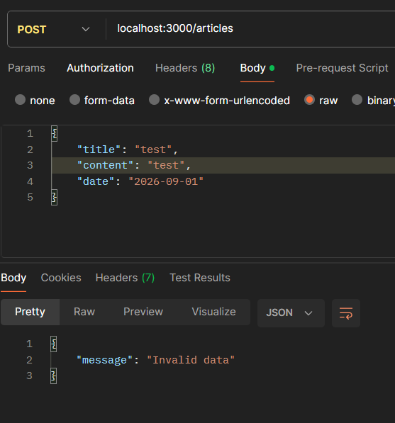

PUT /articles

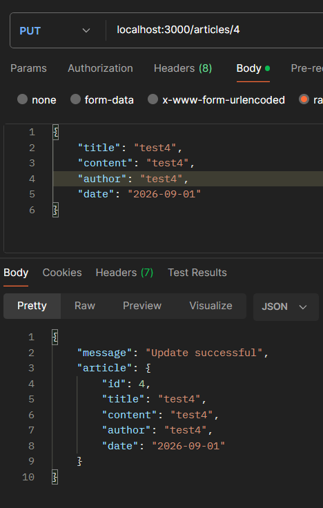

PUT /articles/999

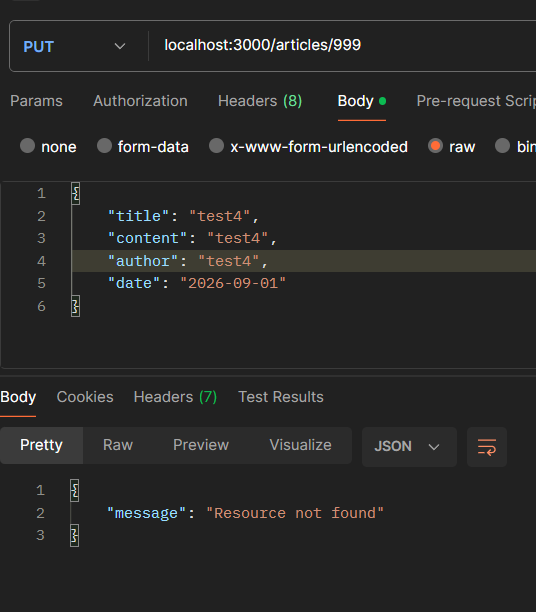

DELETE /articles/1

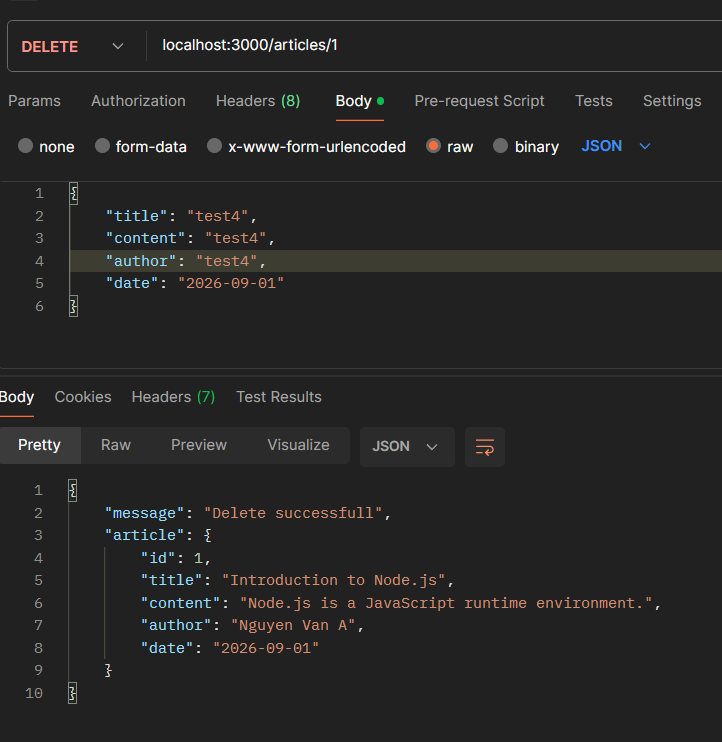

DELETE /articles/999

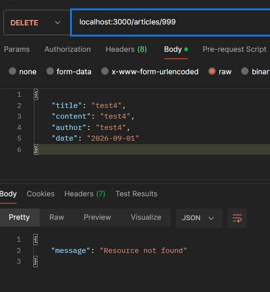

Comment

GET /comments 

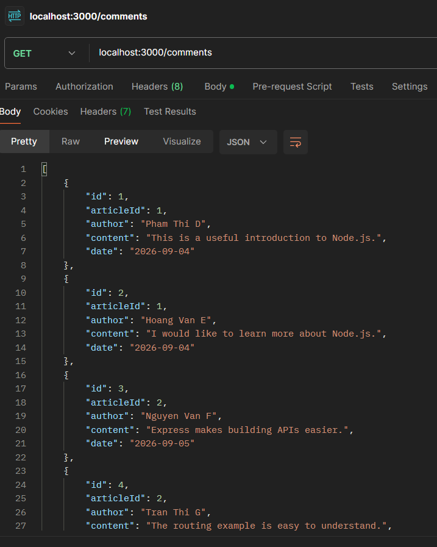   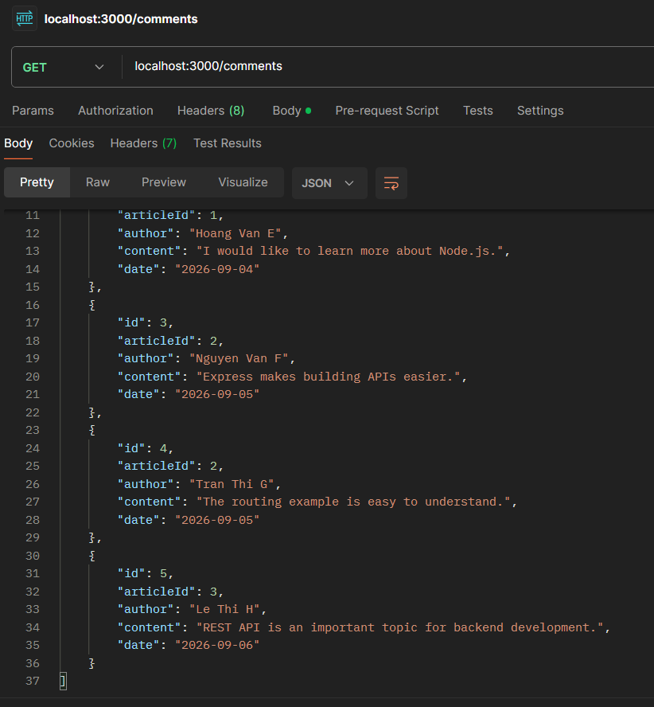

GET /comments:1 

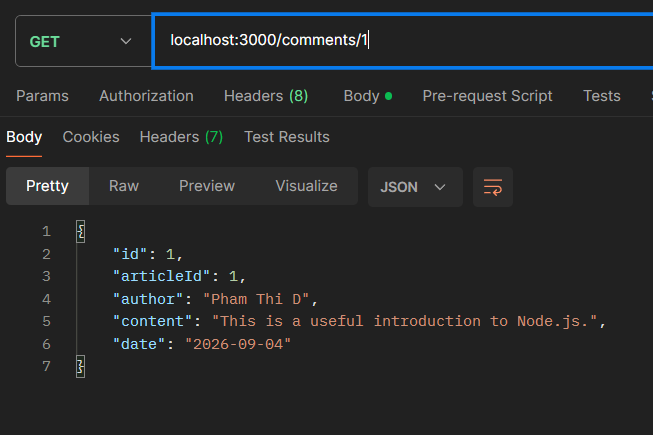

GET /comments:999

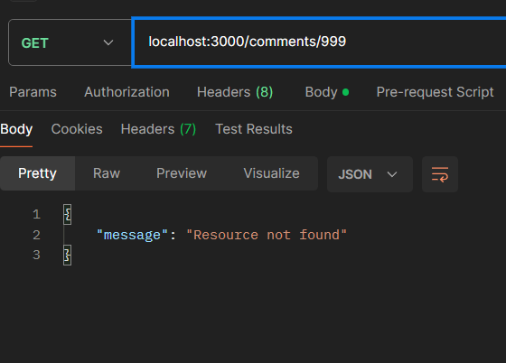

POST /comments      articlelId hợp lệ

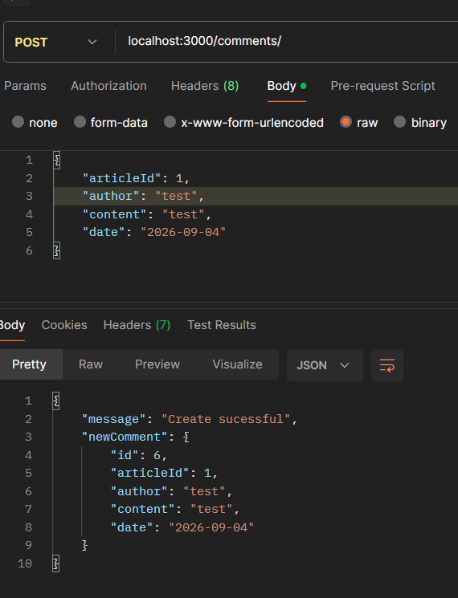

POST /comments      articlelId không tồn tại

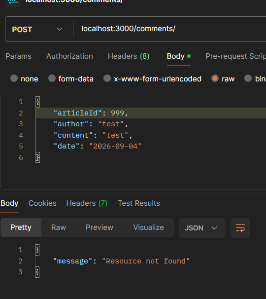

PUT /comments/1

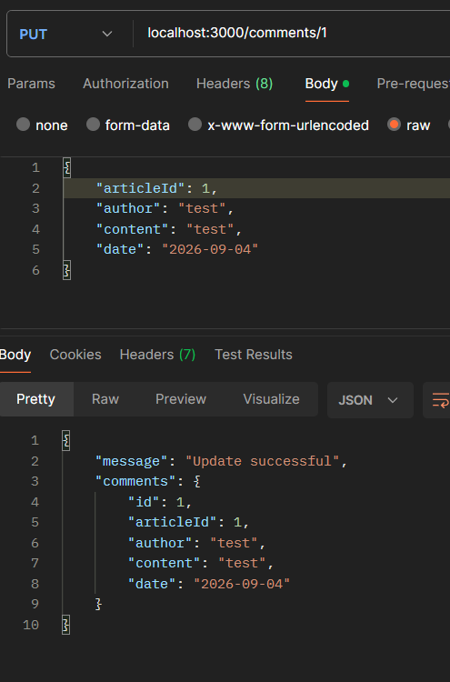

PUT /comments/999

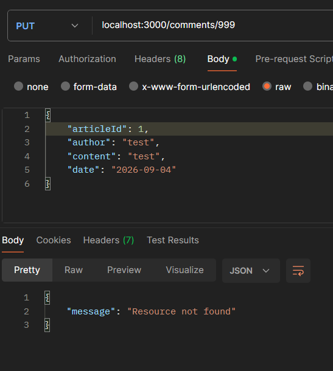

DELETE /comments/1

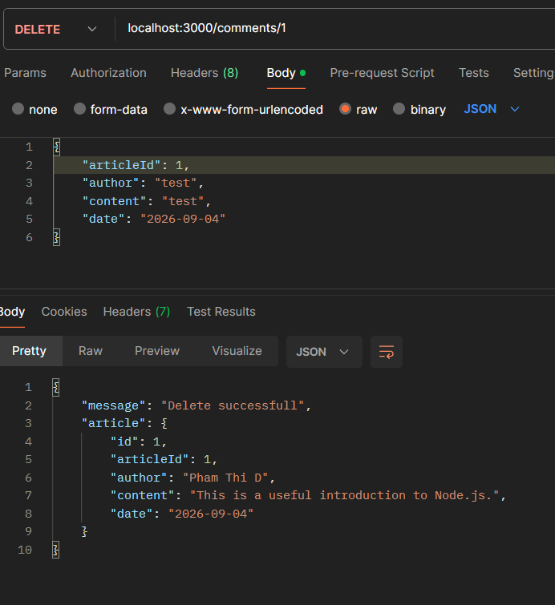

DELETE /comments/999

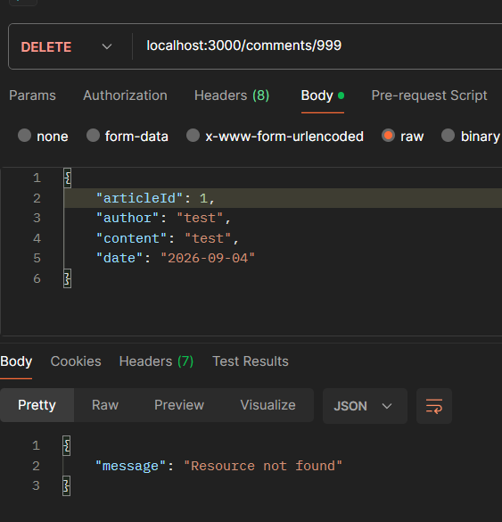
